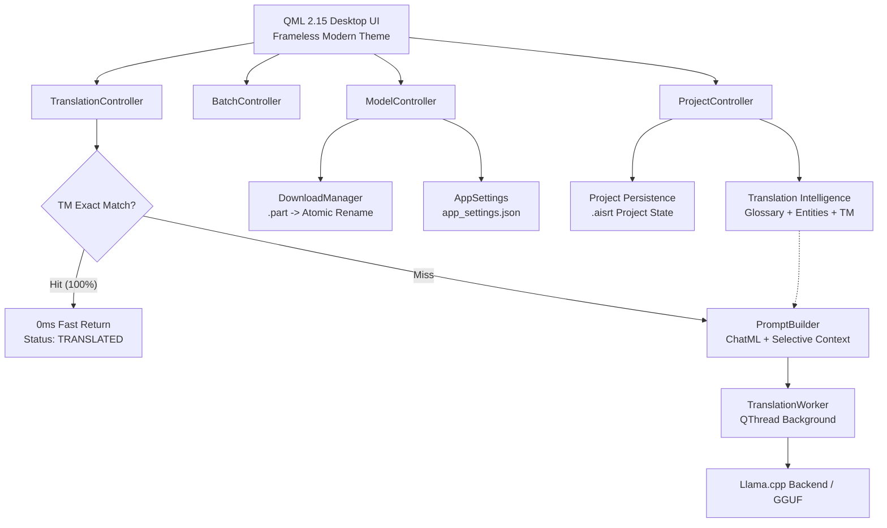

# ◈ AI Subtitle Translator (Offline & Local LLM)

[](https://www.python.org/)
[](https://www.qt.io/)
[-00ADD8?style=flat)](https://github.com/ggerganov/llama.cpp)
[](https://developer.nvidia.com/cuda-zone)
[](LICENSE)

**AI Subtitle Translator** là công cụ dịch và bản địa hóa phụ đề chuyên nghiệp chạy **100% Offline trên máy tính cá nhân (Local LLM)**. Ứng dụng kết hợp sức mạnh của các mô hình ngôn ngữ lớn tiên tiến (Qwen 2.5, DeepSeek R1) với bộ ba trụ cột **Translation Intelligence** (Translation Memory, Glossary, Entity Dictionary) giúp tạo ra các bản dịch phụ đề tiếng Việt tự nhiên, chuẩn văn phong và nhất quán tuyệt đối.

---

## 🌟 Tính năng Nổi bật (Key Features)

### 🧠 1. Translation Intelligence (Trí tuệ Dịch thuật Cốt lõi)
* **Bộ nhớ dịch (Translation Memory - TM):** Tự động lưu trữ các cặp câu đã được xác nhận. Khi gặp câu giống 100%, hệ thống lập tức thực hiện **Short-circuit (0ms latency)**, trả kết quả ngay mà không cần gọi LLM, tiết kiệm tối đa tài nguyên máy.
* **Từ điển thuật ngữ (Glossary):** Khớp từ dài nhất (Longest-match Greedy) không phân biệt thứ tự, hỗ trợ từ dịch ưu tiên và cơ chế **cấm tuyệt đối từ dịch sai** `(ABSOLUTELY FORBIDDEN)`.
* **Từ điển thực thể (Entity Dictionary):** Quản lý nhân vật (`CHARACTER`), địa danh (`LOCATION`), tổ chức (`ORGANIZATION`). Ánh xạ tự động tên biệt danh (alias) về danh xưng chuẩn xác.
* **Selective Context Injection:** Tự động trích xuất ngữ cảnh các câu trước/sau và **chỉ tiêm các thuật ngữ/thực thể thực sự xuất hiện trong câu hiện tại** vào ChatML prompt, bảo vệ tối đa context window và triệt tiêu hiện tượng ảo giác (hallucination).

### ⚡ 2. Batch Translation Engine (Hàng đợi Dịch Tự động)
* Dịch tự động toàn bộ file phụ đề tuần tự với luồng xử lý nền bất đồng bộ (`QThread`).
* **Kiểm soát luồng toàn diện:** Hỗ trợ **Tạm dừng an toàn (Pause/Resume)** và **Hủy bỏ (Cancel)** mà không làm mất mát dữ liệu đã dịch.
* **Checkpoint Snapshot:** Lưu trạng thái thực thi từng câu, cho phép khôi phục tiến trình chính xác ngay cả khi gặp sự cố.

### 🖥️ 3. Smart Model Management (Quản lý Mô hình Thông minh)
* **Hardware-aware Recommendation:** Tự động phân tích GPU (NVIDIA VRAM), RAM hệ thống và trạng thái CUDA wheel để dán nhãn gợi ý mô hình tối ưu (`RECOMMENDED`, `COMPATIBLE`, `NOT_RECOMMENDED`).
* **Advisory Override:** Quyền quyết định cuối cùng luôn thuộc về người dùng, có thể lựa chọn bất kỳ model nào theo ý muốn.
* **Safe Atomic Download:** Cơ chế tải streaming vào file tạm `.gguf.part`, kiểm tra dung lượng toàn vẹn trước khi đổi tên nguyên tử (`os.replace`) sang `.gguf`, ngăn ngừa crash engine do file tải dở dang.
* **Hỗ trợ Danh mục Model Đa dạng:**
  * **Qwen 2.5 7B Instruct (Q4_K_M)**: Tiêu chuẩn vàng cho dịch thuật phụ đề tiếng Việt.
  * **Qwen 2.5 3B Instruct (Q4_K_M)**: Siêu nhẹ, chạy mượt trên GPU yếu (VRAM < 4GB) hoặc CPU.
  * **Qwen 2.5 14B Instruct (Q4_K_M)**: Chất lượng cao cấp cho GPU VRAM ≥ 12GB.
  * **DeepSeek-R1-Distill-Qwen-7B (Q4_K_M)**: Tăng cường suy luận ngữ cảnh và đối thoại sâu.

### 🔒 4. Quyền riêng tư Tuyệt đối (Privacy & Offline First)
* Mọi tiến trình suy luận AI và xử lý dữ liệu đều diễn ra trực tiếp trên phần cứng của bạn.
* Không cần API Key, không gửi phụ đề lên máy chủ đám mây, không phát sinh chi phí theo token.

---

## 🏗️ Kiến trúc Hệ thống (System Architecture)



---

## 💻 Yêu cầu Hệ thống (System Requirements)

| Thành phần | Cấu hình Tối thiểu | Cấu hình Đề xuất (Khuyên dùng) |
| :--- | :--- | :--- |
| **Hệ điều hành** | Windows 10 / 11 64-bit | Windows 10 / 11 64-bit |
| **CPU** | Intel Core i5 / AMD Ryzen 5 (4 cores+) | Intel Core i7 / AMD Ryzen 7 (8 cores+) |
| **RAM** | 8 GB RAM (chạy model 3B trên CPU) | 16 GB - 32 GB RAM |
| **GPU** | Tích hợp (Chạy chế độ CPU Backend) | **NVIDIA RTX 3060 / 4060 (6GB+ VRAM)** với CUDA |
| **Ổ cứng** | 10 GB dung lượng trống (SSD) | 20 GB+ SSD NVMe |

---

## 🚀 Hướng dẫn Cài đặt & Sử dụng (Installation & Setup)

### 1. Yêu cầu Tiên quyết
* Cài đặt **Python 3.11** trở lên ([python.org](https://www.python.org/)).
* Đảm bảo card đồ họa NVIDIA đã cài driver mới nhất (nếu sử dụng GPU).

### 2. Cài đặt Môi trường
```bash
# Clone repository
git clone https://github.com/thaivtkg/AI-Subtitle-Translator.git
cd AI-Subtitle-Translator

# Tạo và kích hoạt môi trường ảo (Virtualenv)
python -m venv .venv
.venv\Scripts\activate

# Cài đặt các thư viện phụ thuộc
pip install -r requirements.txt
```

*(Tùy chọn: Để kích hoạt tăng tốc phần cứng CUDA cho `llama-cpp-python` trên Windows, tham khảo hướng dẫn build wheel CUDA của llama-cpp-python hoặc tải pre-built wheel phù hợp với phiên bản CUDA của máy).*

### 3. Khởi chạy Ứng dụng
```bash
python main.py
```

---

## 📁 Cấu trúc Thư mục Dự án (Project Structure)

```
AI-Subtitle-Translator/
├── app/
│   ├── batch/               # Batch translation domain (job, item, state, checkpoint)
│   ├── controllers/         # Qt Controller bridges (Translation, Batch, Model, Project)
│   ├── core/                # Pure Python domain logic (Catalog, Glossary, Entities, TM, Settings)
│   ├── llm/                 # Model Manager, Worker threads, Backends (llama_cpp, ollama)
│   ├── models/              # Subtitle Qt Table/List Model
│   └── services/            # Pipeline adapter & Download manager
├── docs/                    # Architectural specs & design documentation
├── models/                  # Thư mục lưu trữ các file trọng số .gguf
├── tests/                   # 240+ Unit, E2E, Batch and Integration Test Cases
├── ui/qml/                  # Giao diện Qt Quick QML (Components, Dialogs, Themes)
├── main.py                  # Entrypoint khởi tạo ứng dụng
└── requirements.txt         # Danh sách thư viện Python
```

---

## 🧪 Kiểm thử Tự động (Automated Testing)

Toàn bộ hệ thống được bảo vệ bởi bộ kiểm thử tự động toàn diện với hơn **240 test cases** đạt tỷ lệ **100% PASS**:

```bash
# Chạy toàn bộ test suite
pytest -q

# Chạy riêng nhóm kiểm thử Model Management
pytest -v tests/test_model_management.py

# Chạy riêng nhóm kiểm thử Translation Intelligence
pytest -v tests/test_context_integration.py
```

---

## 📄 Bản quyền (License)

Dự án được phân phối dưới giấy phép mã nguồn mở **MIT License**. Xem chi tiết tại file [LICENSE](LICENSE).
