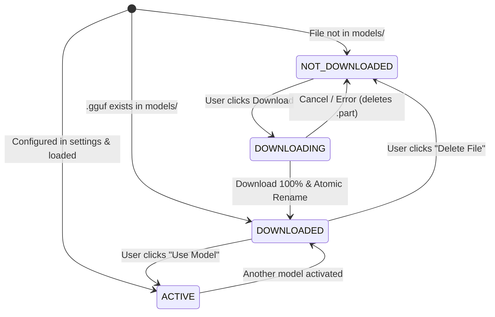

# Cross-cutting: Model Management — Design Spec v1

**Status:** Draft — awaiting user review
**Date:** 2026-10-04
**Scope:** Cross-cutting Model Management (Catalog, Hardware Recommendation, Download Manager, UI & Runtime Binding)
**Depends on:**
- Phase 1–2.5 UI/UX & Backend Architecture (`ModelManager`, `HardwareDetector`)
- Phase 3A Batch Translation Queue
- Phase 3B Translation Intelligence (Glossary, Entities, TM, Context Integration)

---

## 1. Intent and success criteria

Provide a robust, user-friendly, and hardware-aware local model management system. Users can inspect available AI models for subtitle translation, understand which models best fit their hardware (VRAM, RAM, CUDA availability), download models safely with real-time progress, and switch the active translation model without restarting the application.

### Success Criteria:

- **Advisory, Not Authoritative Recommendations:** The system assesses hardware (VRAM, system RAM, CUDA backend status) and assigns informative badges (`RECOMMENDED`, `COMPATIBLE`, `NOT_RECOMMENDED`) with actionable explanations, while granting the user full autonomy to select any model.
- **Strict State Boundary Isolation:** The active model selection belongs exclusively to Application Preferences (`app_settings.json` / `QSettings`). The project state (`.aisrt`) remains 100% agnostic to local model filenames or hardware configurations.
- **Safe, Atomic File I/O:** Models are downloaded to temporary files (`[model_name].gguf.part`). Upon 100% completion and size/checksum verification, an atomic rename promotes the file to `[model_name].gguf`. Incomplete or corrupted files never reach the `llama.cpp` inference engine.
- **Zero-Blocking Concurrency:** File downloads run in dedicated background threads (`QThread`), delivering continuous progress (`progressPercent`, download speed, ETA) without stalling the UI event loop.
- **Seamless Runtime Binding:** Switching the active model safely unloads the current GGUF/Ollama backend instance and reconfigures `TranslationController` and `HardwareProfile`. Switching is safely locked while a translation or batch job is running.

---

## 2. Verified repository context

- `app/core/hardware_detector.py`: Detects NVIDIA GPU via `nvidia-smi`, queries `llama-cpp-python` CUDA backend status, and currently returns a hardcoded profile (`qwen3-8b-q4_k_m.gguf` vs `qwen3-4b-q4.gguf`).
- `app/llm/model_manager.py`: Singleton managing `LlamaCppBackend` and `OllamaBackend`, providing `load_model()`, `unload_model()`, `generate_stream()`, and `cancel()`.
- `app/llm/worker.py`: `TranslationWorker` queries `profile.get("model_path")` or defaults to `models/qwen3-8b-q4_k_m.gguf`.
- `app/controllers/translation_controller.py`: Holds `self.hardware_profile`, passed to `worker_factory`.
- `models/`: Root directory storing local `.gguf` weights (currently contains `qwen3-8b-q4_k_m.gguf`).
- `ui/qml/components/AppHeader.qml` & `AppStatusBar.qml`: Header and status bar displaying project status and engine state (`Ready`, `Translating`, `Not loaded`).

---

## 3. Architecture and design decisions

### 3.1 Model Catalog & Model Registry

The application defines a curated catalog of high-performing, instruction-tuned models optimized for subtitle localization and ChatML formatting.

```python
@dataclass(frozen=True)
class ModelMetadata:
    model_id: str             # Unique key, e.g. "qwen2.5-7b-instruct-q4_k_m"
    display_name: str         # Human-readable title, e.g. "Qwen 2.5 7B Instruct (Q4_K_M)"
    filename: str             # File on disk, e.g. "qwen2.5-7b-instruct-q4_k_m.gguf"
    size_bytes: int           # Exact expected file size in bytes
    size_gb_formatted: str    # Formatted display string, e.g. "4.68 GB"
    min_vram_gb: float        # Minimum VRAM for full GPU offload (e.g. 6.0 GB)
    min_ram_gb: float         # Minimum system RAM if running CPU offload (e.g. 8.0 GB)
    recommended_ctx: int      # Optimal context window (e.g. 4096)
    download_url: str         # Hugging Face direct resolve URL
    description: str          # Description / strong points for translation
```

#### Predefined Catalog Entries:

1. **Qwen 2.5 7B Instruct (Q4_K_M)** *(Default Standard)*:
   - Size: ~4.68 GB | Min VRAM: 6.5 GB | Min RAM: 8.0 GB | Context: 4096
   - Best overall Japanese/Korean/Chinese -> Vietnamese localization accuracy.
2. **Qwen 2.5 3B Instruct (Q4_K_M)** *(Lightweight / Low VRAM)*:
   - Size: ~2.10 GB | Min VRAM: 3.5 GB | Min RAM: 4.0 GB | Context: 4096
   - High speed on entry-level GPUs (GTX 1650, RTX 3050 4GB) or CPU-only mode.
3. **Qwen 2.5 14B Instruct (Q4_K_M)** *(High Fidelity / Enthusiast)*:
   - Size: ~9.00 GB | Min VRAM: 12.0 GB | Min RAM: 16.0 GB | Context: 4096
   - Highest nuance and stylistic mastery for high-end GPUs (RTX 3060 12GB, RTX 4070/4080/4090).
4. **DeepSeek-R1-Distill-Qwen-7B (Q4_K_M)** *(Reasoning / Complex Context)*:
   - Size: ~4.68 GB | Min VRAM: 6.5 GB | Min RAM: 8.0 GB | Context: 4096
   - Deep contextual awareness for slang-heavy and metaphorical dialogue.

---

### 3.2 Hardware-Aware Recommendation Formula

`HardwareDetector` evaluates current hardware against each model's requirements:

```text
Score Calculation & Badge Assignment:
1. Has NVIDIA GPU with CUDA backend:
   - If gpu_vram_gb >= model.min_vram_gb:
     -> Badge: RECOMMENDED (if best fit for VRAM tier) or COMPATIBLE (Full GPU Offload, n_gpu_layers=-1)
   - Else if (gpu_vram_gb >= 2.0 and system_ram_gb >= model.min_ram_gb):
     -> Badge: COMPATIBLE (Partial Offload: GPU + CPU RAM)
   - Else:
     -> Badge: NOT_RECOMMENDED (Insufficient VRAM/RAM: risk of severe lag or OOM)

2. CPU-only mode (No GPU / No CUDA):
   - If system_ram_gb >= model.min_ram_gb + 2.0:
     -> If model is 3B: Badge: RECOMMENDED (CPU Mode)
     -> If model is 7B: Badge: COMPATIBLE (CPU Mode, slower inference)
     -> If model is 14B: Badge: NOT_RECOMMENDED (CPU Mode, very high latency)
```

*Advisory Rule:* If the user chooses a model marked `NOT_RECOMMENDED`, the system displays a confirmation tooltip/warning but executes the choice faithfully without blocking.

---

### 3.3 Safe File I/O & Download Manager

`DownloadManager` handles the complete network download pipeline:

```text
[User clicks "Download"]
       │
       ▼
1. Allocate target path: "models/<filename>.part"
       │
       ▼
2. Network Stream via QThread (requests / urllib with streaming chunks)
   - Calculates real-time progress: bytes_received, total_bytes, progress_percent
   - Calculates speed (MB/s) and ETA (seconds)
   - Emits signals: downloadProgress(model_id, percent, speed_str, eta_str)
       │
       ├─► [User clicks "Cancel"] ──► Terminate stream, remove ".part" file, state = NOT_DOWNLOADED
       │
       ▼
3. On 100% completion:
   - Check local file size == expected size_bytes
   - If size matches:
       Atomic rename: os.replace("models/<filename>.part", "models/<filename>")
       State -> DOWNLOADED
   - Else:
       Emit downloadError("File size mismatch - possible network interruption")
       Remove corrupted ".part" file
```

---

### 3.4 Model Lifecycle State Machine

Each model item in the UI maintains a distinct lifecycle status:



---

### 3.5 Settings Persistence & State Separation

- Model configuration is persisted to `app_settings.json` in user application storage (or `QSettings`):
  ```json
  {
    "active_model_id": "qwen2.5-7b-instruct-q4_k_m",
    "custom_n_ctx": 4096,
    "custom_n_gpu_layers": -1
  }
  ```
- **Project Boundary Rule:** `.aisrt` JSON continues to serialize subtitles, story summary, and intelligence (`glossary`, `entities`, `translation_memory`). Model selection is strictly excluded from `.aisrt`.

---

### 3.6 UI Presentation & User Interaction

1. **Header / Control Bar Trigger:**
   - A compact model selector chip in `AppHeader.qml` or `BatchControlBar.qml`: `[⚡ Qwen 2.5 7B (Recommended) ▼]`.
2. **Model Management Dialog (`ModelManagerDialog.qml`):**
   - **Hardware Summary Banner:** Displays detected GPU, VRAM, RAM, and Backend status.
   - **Model List / Cards:**
     - Title, file size, description.
     - Recommendation badge (`RECOMMENDED`, `COMPATIBLE`, `NOT_RECOMMENDED`) with color-coding.
     - Status: `Active`, `Downloaded`, `Downloading (xx% · y.y MB/s · ETA zz s)`, `Not downloaded`.
     - Action buttons: `Download`, `Cancel`, `Use Model`, `Delete`.
3. **Execution Guard:**
   - Model switching and deletion are disabled while `translationController.status == "TRANSLATING"` or `batchController.state == "RUNNING"`.

---

## 4. API & Interface Contracts

### 4.1 Python Backend Controller: `ModelController` (QObject)

```python
class ModelController(QObject):
    modelListChanged = Signal()
    downloadProgress = Signal(str, int, str, str)  # model_id, percent, speed, eta
    downloadFinished = Signal(str)                 # model_id
    downloadFailed = Signal(str, str)              # model_id, error_message
    activeModelChanged = Signal(str)               # model_id

    # Properties exposed to QML
    @Property("QVariantList", notify=modelListChanged)
    def models(self) -> list[dict]: ...

    @Property(str, notify=activeModelChanged)
    def activeModelId(self) -> str: ...

    @Property(dict, constant=True)
    def hardwareInfo(self) -> dict: ...

    # Slots callable from QML
    @Slot(str)
    def startDownload(self, model_id: str) -> None: ...

    @Slot(str)
    def cancelDownload(self, model_id: str) -> None: ...

    @Slot(str)
    def selectActiveModel(self, model_id: str) -> bool: ...

    @Slot(str)
    def deleteModelFile(self, model_id: str) -> bool: ...
```

---

## 5. Acceptance Contract

| Test ID | Scenario / Behavior | Verification Criteria |
| --- | --- | --- |
| **TC-MM-01** | Hardware recommendation scoring | High VRAM GPU (>= 7GB) assigns `RECOMMENDED` to 7B/8B model; low VRAM (< 4GB) assigns `RECOMMENDED` to 3B model. |
| **TC-MM-02** | Advisory override | User can select a `NOT_RECOMMENDED` model; selection succeeds and sets active model correctly. |
| **TC-MM-03** | Local file detection | Pre-existing `.gguf` files in `models/` are detected immediately as `DOWNLOADED` on startup. |
| **TC-MM-04** | Safe partial download (`.part`) | Active download writes strictly to `.part` file; target `.gguf` does not exist during download. |
| **TC-MM-05** | Atomic promotion on completion | Upon 100% download and verified size, `.part` is atomically renamed to `.gguf` and state becomes `DOWNLOADED`. |
| **TC-MM-06** | Cancel download cleanup | Cancelling a download terminates thread safely and deletes the temporary `.part` file immediately. |
| **TC-MM-07** | Size validation guard | Simulated partial or corrupted stream triggers `downloadFailed` and removes invalid `.part` file. |
| **TC-MM-08** | Runtime backend switching | Selecting a new downloaded model calls `ModelManager.load_model()` with new path and updates `TranslationController.hardware_profile`. |
| **TC-MM-09** | Execution concurrency lock | Attempting to switch active model while translation or batch is running is blocked / rejected. |
| **TC-MM-10** | State separation invariant | Saving and loading `.aisrt` project file does not modify, depend on, or write `active_model_id`. |
| **TC-MM-11** | App settings persistence | Active model preference is loaded on startup from `app_settings.json` (or fallback to hardware recommended default). |
| **TC-MM-12** | Zero-blocking UI during download | Event loop processes UI events smoothly while download thread is actively writing chunks. |

---

## 6. Implementation Plan Preview

1. **Step 1:** Define `app/core/model_catalog.py` (Catalog metadata, dataclasses, hardware scoring logic).
2. **Step 2:** Build `app/services/download_manager.py` (Threaded download worker, `.part` management, atomic promotion).
3. **Step 3:** Implement `app/controllers/model_controller.py` (QObject bridge connecting catalog, download manager, settings, and `ModelManager`).
4. **Step 4:** Create QML components (`ModelManagerDialog.qml`, `ModelCard.qml`, and Header selector trigger).
5. **Step 5:** Wire `ModelController` in `main.py` and connect to `TranslationController`.
6. **Step 6:** Unit and integration test suite (`tests/test_model_management.py` covering all 12 test cases).
